```mermaid
flowchart LR
    subgraph DataIngestion["1. Data Ingestion & ETL"]
        RAW[("🛢️ Raw Sensors / APIs")] --> PREP["🧹 Pandas Preprocessing"]
    end

    subgraph ModelTraining["2. ML Engine"]
        PREP --> TRAIN["🧠 Scikit-Learn"]
        TRAIN --> EVAL["📈 MLflow Tracking"]
    end

    subgraph MLOpsOrchestration["3. MLOps Automation"]
        EVAL --> AIRFLOW["⚙️ Airflow DAGs"]
        AIRFLOW --> DOCKER["🐳 Docker Registry"]
    end

    subgraph ProductionDeployment["4. Production Endpoints"]
        DOCKER --> API["⚡ FastAPI REST API"]
        API --> APP["📱 Flutter Web & Extension"]
    end

    style RAW fill:#0f172a,stroke:#38bdf8,stroke-width:2px;
    style TRAIN fill:#0f172a,stroke:#8b5cf6,stroke-width:2px;
    style AIRFLOW fill:#0f172a,stroke:#ec4899,stroke-width:2px;
    style APP fill:#0f172a,stroke:#22c55e,stroke-width:2px;
```

<div align="center">

<!-- 3D Header Container Box -->
<table width="100%" border="0" cellspacing="0" cellpadding="0">
  <tr>
    <td align="center" style="background-color: #0F172A; border: 1px solid #334155; border-radius: 16px; padding: 20px;">

      <!-- 3D AI & Data Science Background -->
      

      <br/>

      <!-- Dynamic Waving Header -->
      

      <br/>

      <!-- Responsive Typing Animation -->
      <a href="https://git.io/typing-svg">
        
      </a>

      <br/><br/>

      <!-- Quick Social Badges -->
      [](https://linkedin.com/in/mahesh-dakulge)
      [](mailto:maheshm.dakulge@gmail.com)
      [](https://github.com/MaheshDakulge)
      [](#-featured-innovations--hackathons)

    </td>
  </tr>
</table>

</div>

<br/>

<!-- System Specs Container Box -->
<table width="100%" border="0" cellspacing="0" cellpadding="0">
  <tr>
    <td style="background-color: #0F172A; border: 1px solid #334155; border-radius: 16px; padding: 24px;">

      <h2>🧬 AI System Model Card Specification</h2>

```typescript
interface AIArchitectProfile {
  name: "Mahesh Dakulge";
  classification: "Data Scientist & Full-Stack AI Engineer";
  education: {
    degree: "B.Tech in Information Technology";
    status: "Final Year Student (2023–2027)";
    location: "Nanded, Maharashtra, India";
  };
  industry_training: {
    company: "UAIL (Aditya Birla Group / Hindalco Industries)";
    domain: "Copper Refinery Process Analytics & Impurity Prediction";
    impact: "Engineered ML models to minimize Arsenic, Antimony & Bismuth for high-purity cathode production";
    note: "Confidential industrial dataset — architecture & MLOps pipeline summary available on request";
  };
  academic_role: "Instructor — Theory of Computation (3rd Year CSE)";
  core_stack: ["Python", "Scikit-learn", "FastAPI", "MLflow", "Airflow", "Docker", "Flutter", "Supabase"];
}
```

    </td>
  </tr>
</table>

<br/>

<!-- Featured Innovations Container Box -->
<h2>🏆 Featured Innovations & Hackathons</h2>

<table width="100%" border="0" cellspacing="12" cellpadding="0">
  <tr>
    <td width="50%" valign="top" style="background-color: #0F172A; border: 1px solid #334155; border-radius: 16px; padding: 20px;">
      <div align="center">
        <h3>🛡️ SafeGuard AI</h3>
        <p><b>Real-Time Child Safety & Browsing Protection Platform</b></p>
      </div>
      <p>Multi-tenant AI system featuring real-time web scanner, automated domain blocker, parent analytics dashboard, and paired Manifest V3 Chrome Extension. Solo build using ToxicBERT / Vision CNN / GloVe-LSTM.</p>
      <p align="center">
        
        
        
        
      </p>
      <p align="center">
        <b><a href="https://maheshdakulge.github.io/safeguard_ai_live/">🌐 Live Dashboard</a></b> •
        <b><a href="https://maheshdakulge.github.io/safeguard_ai_live/safeguard_extension.zip">🧩 Download Extension</a></b> •
        <b><a href="https://github.com/MaheshDakulge/safeguard_ai_live">📦 GitHub Repo</a></b>
      </p>
    </td>
    <td width="50%" valign="top" style="background-color: #0F172A; border: 1px solid #334155; border-radius: 16px; padding: 20px;">
      <div align="center">
        <h3>📜 NagarDocs</h3>
        <p><b>AI Document-Processing Platform</b></p>
      </div>
      <p><b>🏆 National Hackathon Winner.</b> Intelligent OCR and document metadata extraction engine built for municipal document workflows.</p>
      <p align="center">
        
        
        
        
      </p>
      <p align="center">
        <b><a href="#">📦 GitHub Repo</a></b> •
        <b><a href="#">🌐 Live Demo</a></b>
      </p>
    </td>
  </tr>
  <tr>
    <td width="50%" valign="top" style="background-color: #0F172A; border: 1px solid #334155; border-radius: 16px; padding: 20px;">
      <div align="center">
        <h3>🌾 KisanAlert v2.0</h3>
        <p><b>Crop Price Crash Forecasting Ensemble</b></p>
      </div>
      <p>Predictive ensemble (LSTM + XGBoost + rule engine) forecasting market price crashes for Marathwada farmers, with Marathi voice & WhatsApp alerts.</p>
      <p align="center">
        
        
      </p>
      <p align="center">
        <b><a href="#">📦 GitHub Repo</a></b> •
        <b><a href="#">🌐 Live Demo</a></b>
      </p>
    </td>
    <td width="50%" valign="top" style="background-color: #0F172A; border: 1px solid #334155; border-radius: 16px; padding: 20px;">
      <div align="center">
        <h3>🏭 Copper Refinery Analytics</h3>
        <p><b>Industrial Predictive Modeling & MLOps</b></p>
      </div>
      <p>Built during Data Science Internship at <b>UAIL (Hindalco – Aditya Birla Group)</b>. Industrial sensor ML pipeline reducing Arsenic, Antimony & Bismuth for cathode purity.</p>
      <p align="center">
        
        
        
      </p>
      <p align="center"><b>🔒 Confidential dataset — architecture summary available on request</b></p>
    </td>
  </tr>
</table>

<br/>

<!-- MLOps & Pipeline Container Box -->
<table width="100%" border="0" cellspacing="0" cellpadding="0">
  <tr>
    <td style="background-color: #0F172A; border: 1px solid #334155; border-radius: 16px; padding: 24px;">

      <h2>⚙️ MLOps Pipeline Architecture</h2>



    </td>
  </tr>
</table>

<br/>

<!-- Stats Container Box -->
<table width="100%" border="0" cellspacing="0" cellpadding="0">
  <tr>
    <td align="center" style="background-color: #0F172A; border: 1px solid #334155; border-radius: 16px; padding: 24px;">

      <h2>📊 Live Dynamic Stats & Contribution Matrix</h2>

      
      

      <br/><br/>

      

    </td>
  </tr>
</table>

<br/>

<!-- Contact Footer Box -->
<table width="100%" border="0" cellspacing="0" cellpadding="0">
  <tr>
    <td align="center" style="background-color: #0F172A; border: 1px solid #334155; border-radius: 16px; padding: 24px;">

      

      <h3>📬 Connect & Collaborate</h3>

      [](https://linkedin.com/in/mahesh-dakulge)
      [](mailto:maheshm.dakulge@gmail.com)
      [](https://github.com/MaheshDakulge)

    </td>
  </tr>
</table>
